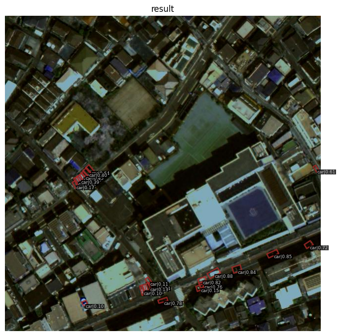

# Article 32976



## 記事
[駐車場に停まっている車両の検知精度アップ？ 衛星データによる車両の回転検知とその実装方法](https://sorabatake.jp/32976/)のコード補完

## 環境構築

- GPU Devide
- Cuda Driver
- Nvidia Docker
- Dcoker Compose

### mmdetectiom
```shell
docker compose -f compose_mmdet-3.yml up -d
```

### mmrotate

```shell
docker compose -f compose_mmrotate.yml up -d
```

CPU usage
comment -> runtime: 'nvidia`
